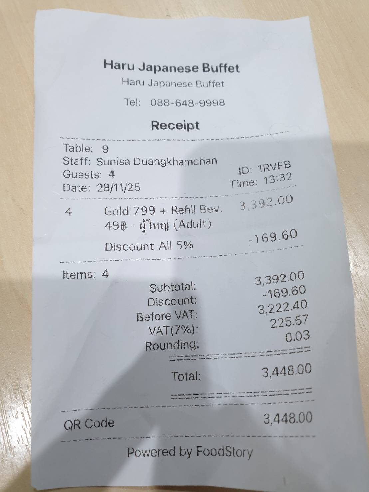

# Typhoon OCR - ระบบ OCR 

## ภาพรวมโปรเจค

Typhoon OCR เป็นระบบ Optical Character Recognition (OCR) ที่พัฒนาด้วยภาษา C# โดยใช้ Typhoon OCR API เป็นหลักในการแปลงข้อมูลจากรูปภาพเป็นข้อความ ระบบถูกออกแบบมาเพื่อให้สามารถแปลงข้อมูลจากเอกสารกระดาษและรูปภาพต่างๆ ให้กลายเป็นข้อมูลดิจิทัลที่จัดเก็บใน Database เพื่อนำไปใช้งานต่อได้

### วัตถุประสงค์หลัก
- แปลงข้อความจากรูปภาพและเอกสารกระดาษให้เป็นข้อมูลดิจิทัล
- จัดการข้อมูลที่ได้จากการ OCR ในรูปแบบที่มีโครงสร้าง
- สนับสนุนการทำงานผ่านหลายช่องทาง (CLI และ Web UI)
- ให้บริการ OCR ที่มีความแม่นยำสูงด้วย Typhoon OCR Engine

## สถาปัตยกรรมระบบ

ระบบถูกออกแบบตามหลักการ Layered Architecture เพื่อความยืดหยุ่นและบำรุงรักษาง่าย

### โครงสร้างโปรเจค

```
Typhoon OCR/
├── Typhoon.Core/              # Logic Layer - ชั้นตรรกะการทำงานหลัก
│   ├── Interfaces/            # ส่วนกำหนด Interface สำหรับการเชื่อมต่อ
│   │   └── IOcrEngine.cs      # Interface สำหรับ OCR Engine
│   ├── Models/                # โมเดลข้อมูลที่ใช้ในระบบ
│   │   ├── ProcessedImage.cs  # โมเดลสำหรับข้อมูลรูปภาพที่ประมวลผล
│   │   └── ExtractionResult.cs # โมเดลสำหรับผลลัพธ์การ OCR
│   ├── Services/              # บริการต่างๆ ของระบบ
│   │   ├── TyphoonCloudOcrEngine.cs # บริการ OCR Engine หลัก
│   │   └── TyphoonOcrApiClient.cs   # API Client สำหรับเชื่อมต่อกับ Typhoon
│   ├── Enums/                 # ค่าคงที่และ Enum
│   │   └── OcrLanguage.cs     # รายการภาษาที่รองรับ
│   └── Typhoon.Core.csproj    # ไฟล์โปรเจคสำหรับ Core Layer
│
├── Typhoon.Console/           # Presentation Layer - CLI Application
│   ├── Program.cs             # โปรแกรมหลักสำหรับ CLI
│   └── Typhoon.Console.csproj # ไฟล์โปรเจคสำหรับ Console App
│
└── Typhoon.Web/               # Web UI Layer (แผนพัฒนาในอนาคต)
    ├── Pages/                 # หน้าเว็บต่างๆ
    ├── Properties/            # คุณสมบัติของ Web Application
    ├── appsettings.json       # การตั้งค่าแอปพลิเคชัน
    ├── appsettings.Development.json # การตั้งค่าสำหรับ Development
    └── Typhoon.Web.csproj     # ไฟล์โปรเจคสำหรับ Web App
```

### การพึ่งพาระหว่าง Layers
```
Typhoon.Console → Typhoon.Core
Typhoon.Web → Typhoon.Core
```

### การไหลของข้อมูล (Data Flow)
```
User Input → Console App → OCR Engine → API Client → OpenTyphoon API → Database
```

## ความสามารถของระบบปัจจุบัน

### 1. CLI Application (Typhoon.Console)
- ✅ รับข้อมูลรูปภาพจากผู้ใช้ผ่าน Command Line
- ✅ เชื่อมต่อกับ Typhoon OCR API
- ✅ แสดงผลลัพธ์การ OCR พร้อมค่าความมั่นใจ (Confidence Score)

## การติดตั้งและใช้งาน

### ข้อกำหนดเบื้องต้น (Prerequisites)

#### ซอฟต์แวร์ที่ต้องติดตั้ง
- **.NET 10.0 SDK** หรือสูงกว่า
  - ดาวน์โหลด: https://dotnet.microsoft.com/download
  - ตรวจสอบเวอร์ชัน: `dotnet --version`
- **Git** - สำหรับ clone repository
  - ดาวน์โหลด: https://git-scm.com/downloads
- **PowerShell 7+** (สำหรับ Windows)
  - ดาวน์โหลด: https://github.com/PowerShell/PowerShell/releases

#### ข้อกำหนดเพิ่มเติม
- **API Key จาก Typhoon OCR** - สำหรับเชื่อมต่อกับ API
- **การเชื่อมต่ออินเทอร์เน็ต** - สำหรับเชื่อมต่อกับ Typhoon OCR API
- **ระบบปฏิบัติการที่รองรับ:**
  - Windows 10/11
  - Linux (Ubuntu 20.04+, Debian 11+, etc.)
  - macOS 11+ (Big Sur) ขึ้นไป

#### Dependencies ที่ติดตั้งอัตโนมัติ
โปรเจคจะติดตั้ง NuGet packages ต่อไปนี้อัตโนมัติเมื่อรัน `dotnet restore`:
- **Microsoft.Extensions.Http** (v10.0.5) - สำหรับ HTTP Client
- **SixLabors.ImageSharp** (v3.1.12) - สำหรับประมวลผลรูปภาพ
- **Tesseract** (v5.2.0) - สำหรับ OCR Engine (สำรอง)

### การติดตั้ง

1. **Clone Repository**
```bash
git clone <repository-url>
cd OCR-APP-C-SHARP
```

2. **ตั้งค่า API Key (ครั้งเดียว)**
```powershell
.\setup-env.ps1 -ApiKey "sk-your-key" -Mode "production"
```

3. **Build Project**
```bash
dotnet build
```

### การใช้งาน

#### 1. ผ่าน Command Line Interface (CLI)

**เริ่มต้นโปรแกรม:**
```bash
cd Typhoon.Console
dotnet run
```

**ตัวเลือกการใช้งาน:**
- กด `Enter` → ใช้รูปภามตัวอย่าง (demo mode)
- ใส่ชื่อไฟล์ (เช่น `38080.jpg`) → ใช้ไฟล์จากโฟลเดอร์ `images`
- ใส่ full path (เช่น `D:\path\image.jpg`) → ใช้ไฟล์จากที่อื่นในระบบ

**ตัวอย่างการทำงาน:**
```
=== Typhoon OCR ===
✅ Using existing API Key from environment
✅ API Key loaded

Enter image filename or path (or press Enter for demo): 38080.jpg

🔄 Processing image: 38080.jpg
=== OCR Result ===
🔒 Confidence: 95.0%

📄 Extracted Text:
----------------------------------------
[ข้อความที่ OCR ได้จากรูปภาพ]
----------------------------------------
Press any key to exit (auto-exit in 5 seconds)...
```
**รูปตัวอย่างการทำงาน:**

<div style="display: flex; gap: 20px; flex-wrap: wrap;">
  <div style="text-align: center;">
    
    <p><em>รูปภาพตัวอย่างที่ใช้ทดสอบ OCR</em></p>
  </div>
  <div style="text-align: center;">
    
    <p><em>หน้าจอการทำงานของ CLI Application</em></p>
  </div>
</div>

## แผนการพัฒนาในอนาคต

### Phase 1: Core System Enhancement
- [ ] เพิ่มการรองรับภาษาต่างๆ (Multi-language support)
- [ ] ปรับปรุงความแม่นยำในการ OCR
- [ ] เพิ่มการจัดการข้อผิดพลาด (Error Handling)

### Phase 2: Database Integration
- [ ] ออกแบบ Database Schema สำหรับเก็บข้อมูล OCR
- [ ] พัฒนา Data Access Layer
- [ ] บันทึกประวัติการ OCR และผลลัพธ์

### Phase 3: Web Application
- [ ] พัฒนา Web UI ด้วย ASP.NET Core
- [ ] สร้างหน้า Upload รูปภาพ
- [ ] แสดงผลลัพธ์แบบ Real-time
- [ ] จัดการข้อมูลผ่าน Web Interface

### Phase 4: Advanced Features
- [ ] Batch Processing (ประมวลผลหลายไฟล์พร้อมกัน)
- [ ] Export ข้อมูลเป็น Excel/CSV
- [ ] การจัดการผู้ใช้งาน (User Management)
- [ ] RESTful API สำหรับการเชื่อมต่อกับระบบอื่น

## เทคโนโลยีที่ใช้

- **.NET 10.0** - Framework หลักสำหรับการพัฒนา
- **C#** - ภาษาหลักในการพัฒนา
- **Typhoon OCR API** - บริการ OCR หลัก
- **Microsoft.Extensions.Http** - HTTP Client สำหรับเชื่อมต่อ API
- **SixLabors.ImageSharp** - ไลบรารีประมวลผลรูปภาพ
- **Tesseract** - OCR Engine (สำรอง)
- **ASP.NET Core** - สำหรับ Web Application (แผนอนาคต)
- **Entity Framework Core** - สำหรับ Database Operations (แผนอนาคต)

## โครงสร้างไฟล์สำคัญ

### IOcrEngine.cs
กำหนด Interface หลักสำหรับ OCR Engine ทุกตัวที่จะใช้ในระบบ

### ProcessedImage.cs
โมเดลสำหรับเก็บข้อมูลรูปภาพที่ผ่านการประมวลผล
- Path ของไฟล์
- ขนาดไฟล์
- วันที่ประมวลผล
- สถานะการประมวลผล

### ExtractionResult.cs
โมเดลสำหรับเก็บผลลัพธ์การ OCR
- ข้อความที่แปลงได้
- ค่าความมั่นใจ (Confidence Score)
- เวลาที่ใช้ในการประมวลผล
- ภาษาที่ตรวจพบ

## การแก้ไขปัญหาที่พบบ่อย (Troubleshooting)

### 1. API Key ไม่ถูกต้อง
```
❌ Error: Invalid API Key
```
**วิธีแก้ไข:** ตรวจสอบ API Key และรัน `setup-env.ps1` ใหม่

### 2. ไม่พบไฟล์รูปภาพ
```
❌ Error: File not found
```
**วิธีแก้ไข:** ตรวจสอบว่าไฟล์อยู่ในโฟลเดอร์ `images` หรือระบุ full path ที่ถูกต้อง

### 3. เครือข่ายมีปัญหา
```
❌ Error: Connection timeout
```
**วิธีแก้ไข:** ตรวจสอบการเชื่อมต่ออินเทอร์เน็ตและสถานะของ Typhoon OCR API

## ผู้พัฒนาและการติดต่อ

สำหรับข้อมูลเพิ่มเติมหรือการสนับสนุน สามารถติดต่อได้ที่:
- GitHub: [Repository Link]
- Email: [Contact Email]

## License

This project is licensed under the MIT License - see the LICENSE file for details.
